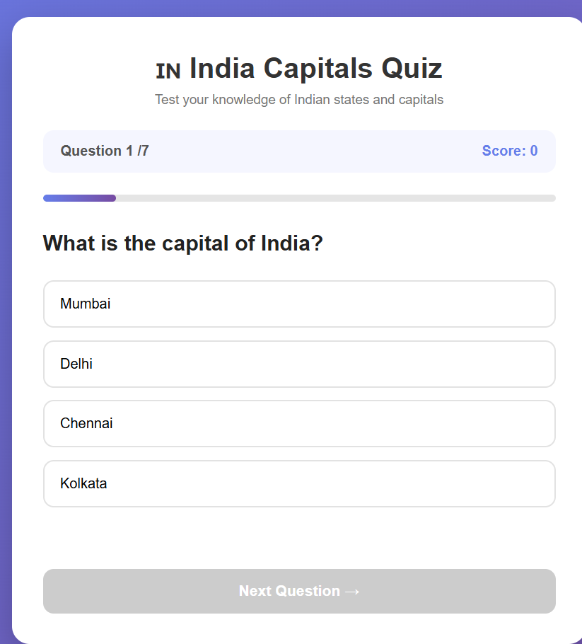
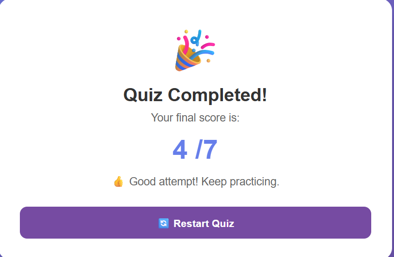

# 🧠 Quiz App

A simple and interactive **Quiz Application built with Python and Flask**. The application provides a clean web interface where users can answer multiple-choice questions and view their final score.

---

## ✨ Features

* 📝 Multiple-choice questions
* 🎯 Answer selection
* 📊 Automatic score calculation
* 🏆 Final score display
* 🔄 Restart quiz functionality
* 💻 User-friendly web interface
* ⚡ Lightweight Flask backend
* 🐍 Python-based application

---

## 🛠️ Technologies Used

| Technology   | Purpose                  |
| ------------ | ------------------------ |
| 🐍 Python    | Application logic        |
| 🌐 Flask     | Web framework            |
| 🎨 HTML      | Page structure           |
| 🎨 CSS       | Styling and layout       |
| ⚡ JavaScript | Client-side interactions |

---

## 📂 Project Structure

```text
Quiz-App/
│
├── main.py
├── requirements.txt
├── README.md
│
└── screenshots/
    ├── quiz-interface.png
    └── quiz-result.png
```

---

## ⚙️ Installation

### 1. Clone the Repository

```bash
git clone https://github.com/your-username/quiz-app.git
```

### 2. Navigate to the Project Folder

```bash
cd quiz-app
```

### 3. Install Dependencies

On Windows:

```bash
py -m pip install -r requirements.txt
```

Or:

```bash
python -m pip install -r requirements.txt
```

If `pip` is configured:

```bash
pip install -r requirements.txt
```

---

## ▶️ Run the Application

Start the Flask application:

```bash
py main.py
```

Or:

```bash
python main.py
```

After starting the application, open your browser and visit:

```text
http://127.0.0.1:5000
```

---

## 🎮 How It Works

1. Launch the Quiz App.
2. Read the displayed question.
3. Select an answer.
4. Continue through the available questions.
5. Submit the quiz.
6. The application calculates the score.
7. View the final result.
8. Restart the quiz to try again.

---

## 📸 Screenshots

### Quiz Interface



### Result Page


---
## 🚀 Future Enhancements

* ⏱️ Add a quiz timer
* 📚 Add multiple quiz categories
* 🎚️ Add difficulty levels
* 🏆 Add a leaderboard
* 💾 Store quiz scores
* 👤 Add user authentication
* 📱 Improve mobile responsiveness
* 🌐 Deploy the application online

---

## 🎯 Project Objective

The main objective of this project is to develop a simple web-based quiz application while gaining practical experience in **Python, Flask, web development, application logic, and user interaction**.

---

## 📚 Learning Outcomes

Through this project, I practiced:

* Python programming
* Flask web application development
* Handling web requests
* Quiz logic implementation
* Score calculation
* HTML and CSS integration
* JavaScript interactions
* Running and testing a web application

---

## 👨‍💻 Author

### Bharath M

**B.Tech Information Technology**
Kongu Engineering College

* GitHub: [@bharathmurugan](https://github.com/bharathmurugan)
* LinkedIn: [Bharath M](https://linkedin.com/in/bharathm12)

---

## 📄 License

This project is created for **educational and learning purposes**.
